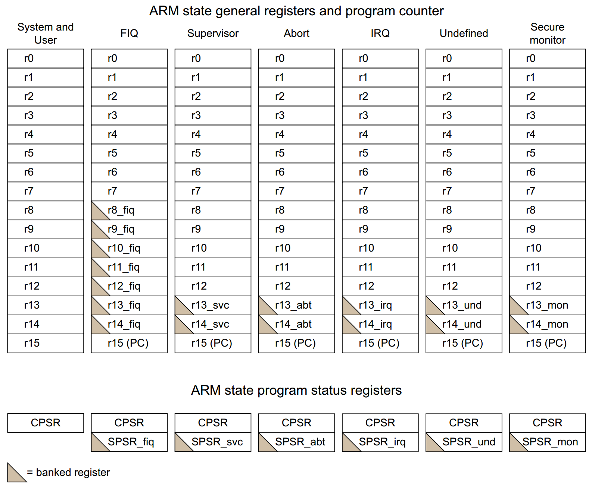
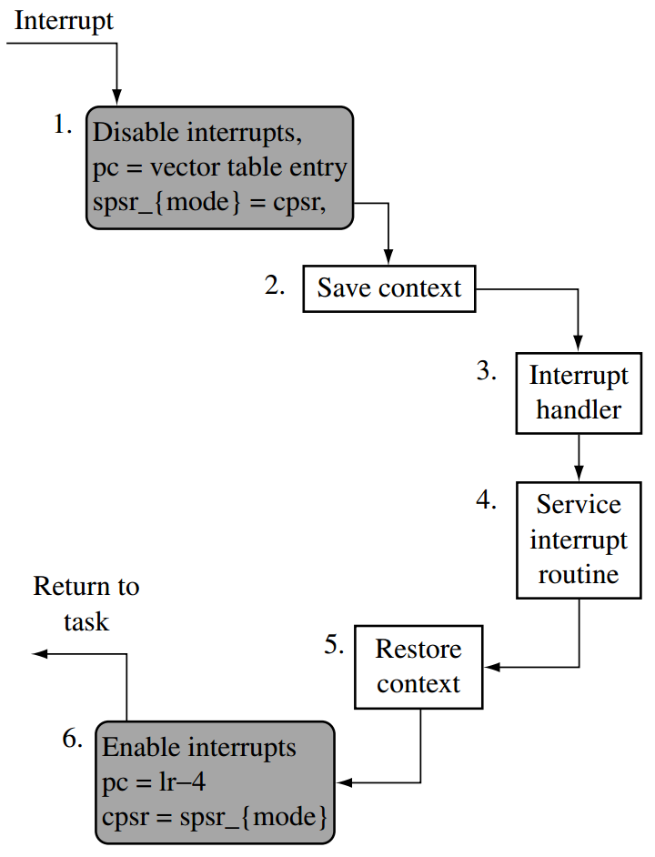

## ARM中的寄存器
ARM处理器中总共有40个寄存器：包括33个通用寄存器，和七个32位的状态寄存器．ARM架构采用了"Banked Register"的设计，33个通用寄存器被映射到 r0-r15 上．有些寄存器在任何模式下都是共用的，某些寄存器在某个模式下有专用的寄存器．这种设计在切换模式时，可以保护其它模式的寄存器．比如Abort，IRQ和UND都把自己的专用寄存器映射到r13和r14上，这样子，每个模式都有自己私有的栈指针和链接寄存器．

其中，除了用户模式，其它都是特权模式．当CPU处于特权模式的时候，其可以通过改变CPSR状态寄存器的[4:0]位来切换操作模式，而处于非特权模式时，只能通过**异常**，中断或者SWI指令来切换模式．
在ARM中，这样的操作模式通常有7种（不包括Monitor和Hypervisor）．本节内容要演示的就是如何通过异常切换CPU的操作模式．
|模式|CPSR寄存器中的位模式|
|:---:|:---:|
|USR|b10000|
|FIQ|b10001|
|IRQ|b10010|
|SVC|b10011|
|ABT|b10111|
|UND|b11011|
|SYS|b11111|
## ARM中的异常
当异常发生时，ARM处理器会执行下列操作：
1. 将CPSR拷贝进用于处理异常所使用的操作模式的SPSR寄存器中．
2. 修改CPSR的[4:0]位让CPU进入需要的操作模式中，并关闭中断．
3. 将返回地址设置到LR_<mode>寄存器中
4. 将PC程序计数器设置成异常向量的地址．
## 异常向量表
当异常发生的时候，处理器的指令地址会被强制变为与异常类型相关的一个地址．这个地址被称为异常的*异常向量*．

一组异常向量由八个连续的字对齐的，始于*异常基地址*的存储地址组成．这组八个向量形成了一个*向量表*．不同的架构和扩展，可能会有不同数量的向量表，本节我们只考虑存在一个向量表的情况．通常这八个向量所指向的指令，都是让CPU跳转到相关的异常处理函数上（因为FIQ是异常向量表的最后一项，有些时候为了速度，FIQ的处理函数可能就直接位于向量处了）．当跳转到相关的异常处理函数时，ARM会将返回地址保存在当前模式的链接寄存器r14上．不同的异常类型，优先保存的返回地址类型可能会不一样．当异常结束时，CPU需要把r14寄存器中的值减去偏移量移入PC寄存器中．

链接寄存器保存的值通常是以值+偏移的形式保存的，偏移量的大小取决于指令集状态和异常类型．之所以会这样，是因为指令流水线的设计导致的，因为当异常发生时，处理器可能已经预取了一些指令．这就意味着，当异常发生时，PC寄存器中的值可能已经超过了实际发生异常的那条指令的地址，所以为了返回正确的地址，需要减去对应的偏移量．
|异常|ARM|Thumb|
|:---:|:---:|:---:|
|UND|+4|+2|
|Supervisor Call|None|None|
|Prefetch Abort|+4|+4|
|Data Abort|+8|+8|
|IRQ or FIQ|+4|+4|
|Virtual IRQ or Virtual FIQ|+4|+4|

## 异常处理函数的函数序言和函数尾声
因为异常可能随时发生，编译器无法预测哪些寄存器的值会被改变，需要被修复，所以异常处理函数的函数序言不像普通函数那样，异常处理函数的函数序言会保存所有可能被改变的寄存器的值，此外异常处理函数还需要恢复之前的CPSR的值，因为进入异常时，会改变CPSR的值，比如关闭中断（实际上当`movs`指令的目标是PC寄存器时，它会自动将SPSR的值拷贝到CPSR上）．因为zig的`callconv(.Interrupt)`目前只支持x86_64，所以这里借助C-ABI调用zig函数
```c
void __attribute__((interrupt))handler()
{
    // zig handler
}
```
## 中断的关闭和使能
ARM处理只接收两个外部中断请求，FIQ和IRQ．两者对处理器来说都是低电平有效．但是，做过嵌入式开发的我们都知道，外部世界的中断来源，可不仅仅有两个，有由鼠标的，串口，键盘的等等的外设设备产生的中断．只有两个请求信号显然是不够用．于是在ARM内核之外，厂商可以根据自己的需求设计自己的VIC（Vectored Interrupt Controller）.VIC可以将多个外部中断连接到这两个中断请求上．所以当我们关闭或者使能中断时，有两个选择，一个是从设备端的VIC关闭或者使能中断，另一个是控制CPU的CPSR寄存器中的I位．这也是最简单的方法.（当我们要写特定于架构而设备无关的关闭中断的锁时，控制CPSR显然是唯一选择，如下）
```c
lock:
    MRS r1, CPSR        ; read CPSR into r1
    ORR r1, r1, #0x80   ; set bit-7(I bit) to 1
    MSR CPSR, r1        ; write r1 back to CPSR

unlock:
    MRS r1, CPSR        ; read CPSR into r1
    BIC r1, r1, #0x80   ; clear bit-7 (I bit) in r1
    MSR CPSR r1         ; write r1 back to CPSR
```
## 中断的标准行为
当IRQ或者FIQ异常发生时，处理器硬件的标准流程是（ARMv7M采用另一套策略，这里不做赘述）：
1. 硬件确定该异常应该被带入到哪个操作模式去
2. 设置lr的值，该值取决于准备进入的是哪个操作模式．
3. CPSR的值被保存进对应的SPSR寄存器中．
4. 更新CPSR的内容，包括：
   + 把CPSR.M设置为对应的操作模式
   + 设置CPSR的掩码位．这可以关闭相关的异常，防止不受控的嵌套的异常发生．
   + 设置指令集状态
   + 设置需要的字节序
   + 把CPSR.IT[7:0]设置为０
5. 把对应的异常向量加载进PC中 
6. 从PC保存的地址处继续执行代码
## non-nested中断
当我们需要开发一种只靠中断驱动的嵌入式系统时，中断延时往往是我们要考虑的主要因素．中断延时是指从外部中断请求信号发生到CPU抓取特定的ISR（Interrupt Service Routine）的第一条指令所经过的时间．在进入一个中断的之前，硬件会自动把CPSR的I位设为0，并阻止了其它中断的发生，这必然会增加了其它中断的延时，这种中断，称为**non-nested Interrupt**．那么有什么办法可以减少这个中断延时呢？在说如何减少这个中断延时之前，我们先看看如何实现最简单的**non-nested Interrupt**.



## 用例
### 计时器
### 键盘
在本节，我们将使用中断开发一个键盘驱动，ARM Versatile开发板包含了一个ARM PL050 Mouse-Keyboard Interface，其支持PS/2兼容的键盘．键盘的基地址是`0x1000600`

